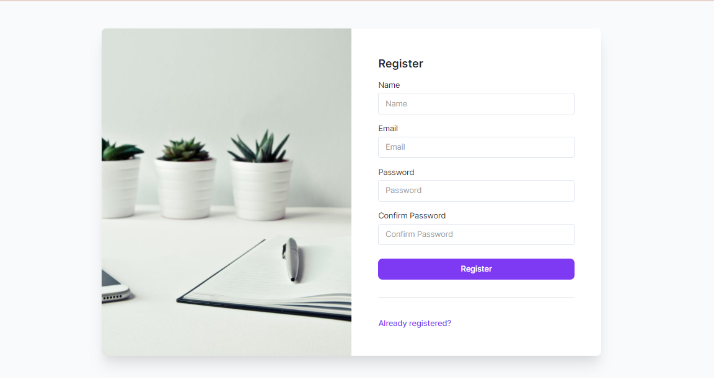
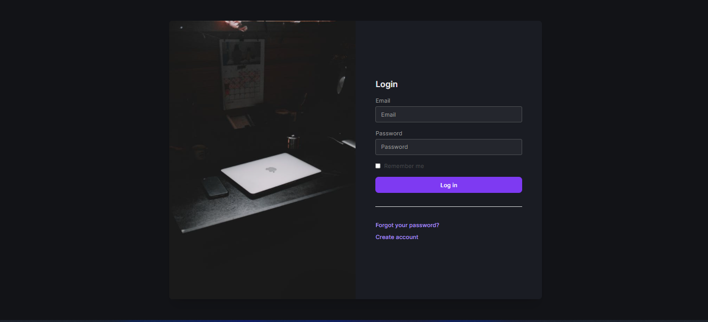
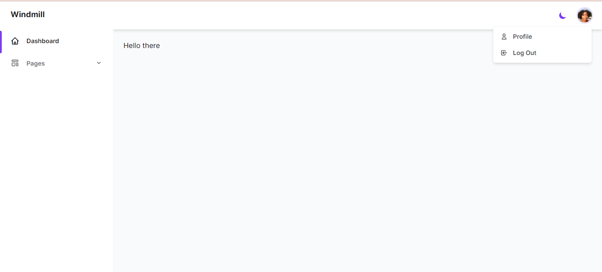

# Windmill Breeze Laravel starter

## Installation

```bash
git clone https://github.com/erastimothy/windmill-breeze-ui.git
cd windmill-breeze-ui

composer install
cp .env.example .env

php artisan key:generate
php artisan migrate

npm install && npm run dev

php artisan serve
```
#### Screenshots

|                             |                             |
| --------------------------- | --------------------------- |
|  |  |
|  |  |
